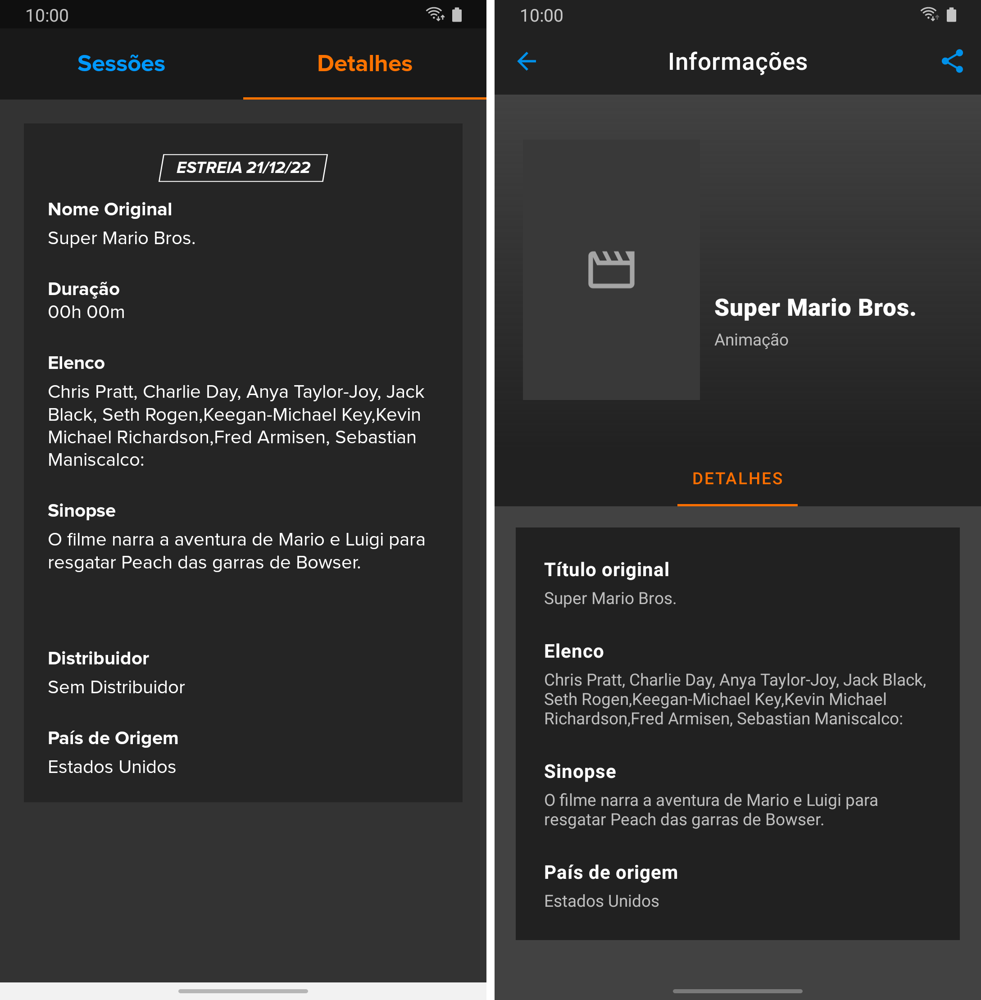

# Ingresso.com Mobile Android App Challenge

## Walkthrough

### Architecture

I've chosen to adopt MVVM because of the simplicity of the project, but any other architecture would've done the job well just fine.

### UI

The UI was mainly built using Android `View` system's `ConstraintLayout`, with the goal of looking as similar as possible to the
official Ingresso.com Android app.

#### Navigation

Here, I'm using [Android Navigation's safe args](https://developer.android.com/guide/navigation/navigation-pass-data#Safe-args), which
allows me to declare the argument that a certain screen requires right into the navigation graph, and then navigate to it in code
directly through `NavDirections`.

#### Movie details screen

Some weird-looking behavior I've noticed while working with the API:

- It returns the cast of a movie as a whole string instead of a string array. Some are comma-separated without trailing spaces, making
it difficult to visually distinguish one actor from the other;
- It adds some random line breaks at the start and/or at the end of some movies' synopsis;
- It sets "Sem Distribuidor" as a value of the `distributor` JSON field for movies that do not have a distributor instead of setting it
as `null`.

I'm pointing those particular inconsistencies out because I saw that they are also present in the official app itself. I did my
best to work them out in my end by checking whether a given field is null (or empty, in the case of an array) and to omit their
respective sections if they are; and also by trimming the strings handed by the API that are subject to extra line breaks. One example
is the code snippet below, taken from `MovieDetailsFragment`, hides the cast section if the cast list is empty:

```kotlin
binding.castView
    .apply { description = movie.cast.joinToString() }
    .also { it.isVisible = movie.cast.isNotEmpty() }
```

And the following is a comparison of the final result, both in the official app (left) and in mine (right):

<p align="center">
    
</p>

### Remote data fetching

The app uses [Retrofit](https://square.github.io/retrofit) to execute a GET request to the given API, serializes the array of movie
objects through Gson, converts it into a `MovieDto` (Kotlin version in the `:network` module that mimics the received object), then,
later on, turns this `MovieDto` into a `Movie` object ready to be displayed to the user.

I've decided to use [Retrofit's RxJava3 adapter](https://mvnrepository.com/artifact/com.squareup.retrofit2/adapter-rxjava3) to make the
job of processing the return values with Kotlin's `Flow` a bit easier, since they provide a
[library just for that](https://kotlin.github.io/kotlinx.coroutines/kotlinx-coroutines-rx3).

Getting into the UI bit, the app refreshes when it's launched and, from now on, it has two pathways:

- Display the list of `Movie`s that were fetched from the API;
- Pop an error message up, warning the user that they aren't connected to the internet.

In the latter case, it observes the connectivity availability through a library called
[FlowReactiveNetwork](https://github.com/phansier/FlowReactiveNetwork), that wraps the network state into a `Flow`, which is then
collected in the movies screen to refresh the app whenever it is able to do so.

## Modularization

Below is a list of all the modules present in the app, alongside with a description of exactly what it does.

| Module        | Description
----------------|---------------------------------------------------------------------------------------------------------------------------------------------------------------------------
| `:app`        | Main module. Does not have any Kotlin/Java code; Applies the app theme and sets `:ui`'s `MainActivity` as the one to be launched when the app is open.
| `:extensions` | Kotlin extensions that are not tied to any app module.
| `:model`      | Data classes that represents entities intrinsic to the business logic, such as `Movie`.
| `:network`    | Responsible for interacting directly with the API and handing back its responses to the app.
| `:repository` | Converts API responses from `:network` into `:model` classes and wraps them into Kotlin `Flow`s that widely consumed throughout `:ui`.
| `:ui`         | Visual UI elements and Android architecture components built specifically for the app with no generic use cases such as `:ui-core`'s.
| `:ui-core`    | Core UI elements to be used in `:ui` that extend fundamental system classes, such as `AppCompatActivity` and `Fragment`, and are not subject to a specific use case.

## Final considerations

If there's any other information that you'd like to know about and haven't encountered in this README, please, let me know!
