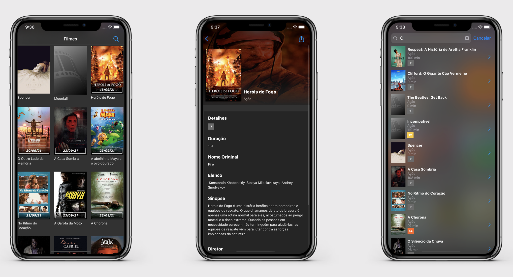
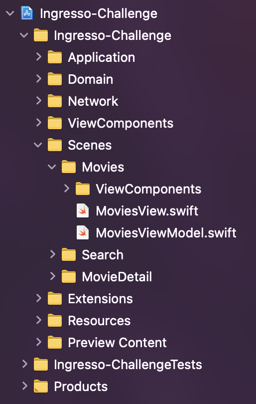

# Desafio Mobile

O desafio consiste em criar um aplicativo que consuma uma API da Ingresso.com e apresente o resultado na tela.
A tela deve conter uma lista com os filmes que deverão entrar em cartaz em breve.

## Interface

## Features

- [x] Tela de loading
- [x] Lista dos filmes em breve em cartaz
- [x] Busca
- [x] Tela de detalhes
- [x] Compartilhamento

## Estrutura do projeto e Arquitetura
O projeto foi desenvolvido adotando conceitos da Clean Architecture e MVVM. Existindo três grandes "camadas":
- Network: Modelos da resposta da API + Chamada a API + Repositório/Data Source dos dados. Essa camada é responsável por fazer a chamada a API e foi desenvolvida usando o Repository Pattern, que para o projeto só foi preciso criar o DataSource da API. Porém a escolha desse padrão permite a adoção de novas fontes de dados de maneira fácil, apenas precisando criar outros arquivos de DataSource que serão acessados pelo Repository.
- Domain: Entidades usadas no contexto da aplicação (no caso o modelo do Filme). Essa camada armazena o modelo do dado do Filme com apenas os campos necessários para o contexto da aplicação.
- Scenes: Interface do usuário, usando MVVM. Essa camada cria todas as telas do App de maneira modularizada.

  

## Como rodar?
1. Clonar o repositório ou fazer download do arquivo zip.
2. Abrir o arquivo `Ingresso-Challenge.xcodeproj` com o Xcode.
3. Rodar o projeto no Xcode.

## Requisitos
- iOS 14+
- Swift 5
- SwiftUI 2.0
- Xcode 12.5.1

## Frameworks

- [**URLImage**](https://github.com/dmytro-anokhin/url-image): É uma SwiftUI view que realiza o download e exibição de imagens de uma URL, permitindo colocar um placeholder enquanto o carregamento ocorre. Também faz o cache local da imagem tando em memória quanto em disco. Foi adotado no projeto para facilitar o desenvolvimento, uma vez que esse framework faz o carregamento de imagens assíncronas sem causar travas na interface e faz o cache local sozinho.

O gerenciador de dependência escolhido foi o `Swift Package Manager`

## Comentários
De inicio, agradeço pela oportunidade de participar do desafio. Foi meu primeiro desafio técnico desenvolvido para um processo seletivo e tentei trazer nele a maior parte do meu conhecimento adquirido durante os quase 2 anos de desenvolvimento iOS na Apple Developer Academy | PUC-Rio.

Acabei me engajando bastante na jornada de criação do projeto pois estava a um tempo sem ver SwiftUI, já que meu último trabalho havia sido em UIKit. Pude me lembrar da facilidade e velocidade para entregar uma solução usando esse framework, ao mesmo tempo que alguns "workarounds" foram feitos para atingir os efeitos desejados. No projeto em si, para colocar a Navigation Bar transparente na tela de detalhes, mas não nas demais, foi um sufoco 😅.

Pra fechar, acho válido comentar que poderia ser disponibilizado o esquema dos dados da API (formato do JSON). Durante o desenvolvimento um dos campos, que nas minhas chamadas anteriores vinha como nil (o que não permitia saber o formato dele), em um determinado momento veio com um valor diferente, fazendo a mensagem de erro ser exibida na interface, até que concertei.

Mais uma vez, obrigado pela oportunidade e qualquer dúvida estou aberto para responder.
